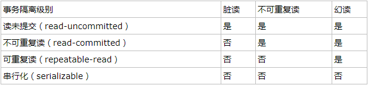

mysql事务
===
目录
---
* [概述](#概述)
* [特性](#特性)
* [事务相关知识点](#事务相关知识点)
* [事务并发会造成的问题](#事务并发会造成的问题)
* [事务隔离级别](#事务隔离级别)
* [相关命令](#相关命令)
* [参考](#参考)

概述
---
事务是一个不可再分的工作单位。

特性
---
* 原子性
    
    事务的一系列操作，要么都执行成功，要么都不执行。
* 一致性

    在事务开始之前和事务结束以后，数据库的完整性没有被破坏。
* 隔离性

    数据库允许多个并发事务同时对数据进行读写和修改，隔离性可以防止多个事务并发执行时由于交叉执行而导致数据的不一致。
    
* 持久性

    事务处理结束后，对数据的修改就是永久的，即便系统故障也不会丢失。
    
事务相关知识点
---
* InnoDB引擎支持事务，MyISAM不支持事务
* 在"自动提交"模式，提交给mysql的命令会自动提交。可以设置`set autocommit = 0`，来禁止自动提交

事务并发会造成的问题
---
* 脏读

    事务A读取了事务B更新后的数据，事务B回滚，事务A读到的数据就是脏数据
* 不可重复读
    
    事务A重复读取一个数据，在其读取过程中，事务B对数据进行更新，导致事务A读取的数据不一致
* 幻读
    
    事务A将所有数据从1变为2，事务B在过程中新插入一条数据1，事务A提交更新后读取到了1，就好像读到了之前的数据一样，产生幻读

事务隔离级别
---
>通过设置事务的隔离级别来解决上述问题

* 读未提交

    可以读取事务未提交的数据，不能解决上述任何问题
* 读已提交

    只可读取事务提交后的数据，可以解决脏读，但不能解决不可重复读和幻读的问题
* 可重复读

    事务读取到的数据是一个快照，另一个事物的提交不会改变当前事务的快照，解决了不可重复读，但没有解决幻读问题
* 串行化
    
    事务隔离级别设置为串行化时会锁表，其他事务就不能对表进行更新操作，解决了幻读问题。
   
>事务隔离性越高，越能保证数据的一致性和完整性，但并发性能会较低。一般将事务隔离级别设置为读已提交，解决脏读问题，不可重复读和幻读问题可通过应用程序采用所来解决

    

相关命令
---
* 查看当前mysql事务隔离级别 `select @@global.tx_isolation`
* 查看mysql会话级别的事务隔离级别 `select @@tx_isolation`
* 设置系统的事务隔离级别 `set global transaction isolation level read committed`
* 设置会话的事务隔离级别 `set session transaction isolation level read committed`
* 查看autocommit变量 `select @@autocommit`
* 设置不自动提交 `set autocommit = 0`
* 开启事务，使用 `start transaction` 或 `begin`
* 事务回滚 `rollback`
* 事务提交 `commit`
* 在事务中创建一个保存点 `savepoint x1`，之后可以回滚或提交到保存点，`rollback x1` `commit x1`
>可以设置的隔离级别 read uncommitted，read committed，repeatable read，serializable

### 参考
[MySQL的四种事务隔离级别](https://www.cnblogs.com/huanongying/p/7021555.html)