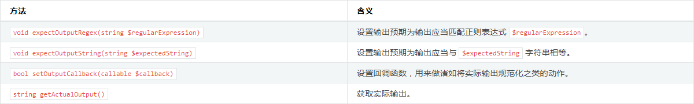

phpunit学习笔记
===
目录
---

[安装phpunit](#安装phpunit)  
[编写 PHPUnit 测试](#编写_PHPUnit_测试)  
[参考](#参考)  
[命令行测试执行器](#命令行测试执行器)  
[基境(fixture)](#基境(fixture))  

安装phpunit
---
* PHP 档案包 (PHAR)
    
    >详细见 : [安装 PHPUnit](https://phpunit.readthedocs.io/zh_CN/latest/installation.html)
* Composer

    >如果用 Composer 来管理项目的依赖关系，只要在项目的 composer.json 文件中简单地加上对 phpunit/phpunit 的依赖关系即可：
    `composer require --dev phpunit/phpunit ^6.5`

编写 PHPUnit 测试
---
* 用PHPUnit编写测试的基本惯例与步骤 [@](examples/NumTest.php)

    1. 测试类都写在 `ClassTest` 中，比如 `UserTest`。
    2. 测试类都继承自 `PHPUnit\Framework\TestCase`。
    3. 具体测试都写在 `test*` 的方法中。
    4. 在测试方法中使用断言方法来判断实际结果与预期值是否匹配。
    
* 测试的依赖关系 [@](examples/DependsTest.php)

    * 每个测试方法并不一定必须是一个独立的测试单元，也可以作为其它测试的依赖。
    * **生产者在代码中必须位于依赖于它的消费者上方**  。
    * 允许多重依赖。

    * 生产者(producer)，是能生成被测单元并将其作为返回值的测试方法。
    * 消费者(consumer)，是依赖于一个或多个生产者及其返回值的测试方法。
    
    >默认情况下，生产者所产生的返回值将“原样”传递给相应的消费者。这意味着，如果生产者返回的是一个对象，那么传递给消费者的将是一个指向此对象的引用。如果需要传递对象的副本而非引用，则应当用 `@depends clone` 替代 `@depends`。

* 数据供给器 [@](examples/ProviderTest.php)

    * 测试方法可以接受任意参数。用 `@dataProvider` 标注来指定使用哪个数据供给器方法。
    * 数据供给器方法必须声明为 public，其返回值要么是一个数组，其每个元素也是数组；要么是一个实现了 `Iterator` 接口的对象，在对它进行迭代时每步产生一个数组。每个数组都是测试数据集的一部分，将以它的内容作为参数来调用测试方法。
    * 数据供给器返回的数组可以使用字符串作为键名，在某一组数据测试出错时有友好提示
    * 如果测试同时从 `@dataProvider` 方法和一个或多个 `@depends` 测试接收数据，数据供给器的参数先于依赖传入，依赖对应位置的参数每次都是一样的。
    * 使用了数据供给器的测试，该测试的返回数据不能传入依赖于该数据的测试。

* 对异常进行测试 [@](examples/ExceptionTest.php)

    * 在测试中调用 `expectException()` 、`expectExceptionCode()`、`expectExceptionMessage()` 或 `expectExceptionMessageRegExp()`方法为被测代码所抛出的异常建立预期，如果之后抛出指定异常，则测试成功。
    * 使用标注可以完成同样的测试 : `@expectedException` 、 `@expectedExceptionCode` 、 `@expectedExceptionMessage` 和 `@expectedExceptionMessageRegExp`。

* 对错误进行测试 [@](examples/ExceptionTest.php)
    * 默认情况下，PHPUnit 将测试在执行中触发的 PHP 错误、警告、通知都转换为异常。利用这些异常，预期测试将触发 PHP 错误。
    * PHP 的 error_reporting 运行时配置会对 PHPUnit 将哪些错误转换为异常有所限制。

* 对输出进行测试 [@](examples/ExceptionTest.php)
    * PHPUnit使用 PHP 的 **`输出缓冲`** 特性来为此提供必要的功能支持。
    
    
    
* 错误相关信息的输出
    >当有测试失败时，PHPUnit 全力提供尽可能多的有助于找出问题所在的上下文信息。

* 边缘情况
    >当比较失败时（测试已经failure），PHPUnit 为输入值建立文本表示，然后以此进行对比，输出错误对比信息，所以可能输出的信息中，错误的地方比实际不匹配的地方多。

命令行测试执行器
---
可以通过执行 `phpunit` 命令来运行测试。例如：`phpunit ClassTest` ，PHPUnit 命令行测试执行器将在当前工作目录中寻找 ClassTest.php 源文件并加载之。而在此源文件中应当能找到 ArrayTest 测试用例类，此类中的测试将被执行（大多数测试类是这样编写的，但文件名和类名可以不相同）。

* 对于每个测试的运行，PHPUnit 命令行工具输出一个字符来指示进展：

    * ` . ` 当测试成功时输出。  
    * ` F ` 当测试方法运行过程中一个断言失败时输出。  
    * ` E ` 当测试方法运行过程中产生一个错误时输出。  
    * ` R ` 当测试被标记为有风险时输出（参见:ref:risky-tests）。  
    * ` S ` 当测试被跳过时输出（参见:ref:incomplete-and-skipped-tests）。  
    * ` I ` 当测试被标记为不完整或未实现时输出（参见:ref:incomplete-and-skipped-tests）。

* 选项:

    * ` --colors ` 使用彩色输出。  
    * ` --repeat ` 将测试重复运行指定次数。  
    * ` -d ` 置指定的 PHP 配置选项的值。  
    * 更多选项查看官方文档: [PHPUnit Manual](https://phpunit.readthedocs.io/zh_CN/latest/)

基境(fixture)
---
* 基本使用 [@](examples/StackTest.php)

    在编写测试时，最费时的部分之一是编写代码来将整个场景设置成某个已知的状态，并在测试结束后将其复原到初始状态。这个已知的状态称为测试的 基境(fixture)。

    * `setup()` 每个测试方法在运行之前运行一次，可以在此方法中初始化测试需要的环境。  
    * `tearDown()` 每个测试方法在测试结束后运行一次，可以用来销毁 `setUp()` 中加载的资源。  

* 共享基境 [@](examples/StackTest.php)

    在测试之间共享基境会降低测试的价值。潜在的设计问题是对象之间并非松散耦合。如果解决掉潜在的设计问题并使用桩件(stub)（参见:ref:test-doubles）来编写测试，就能达成更好的结果，而不是在测试之间产生运行时依赖并错过改进设计的机会
    * `setUpBeforeClass()` 在第一个测试方法运行之前运行一次。  
    * `tearDownAfterClass()` 在最后一个测试方法运行结束运行一次。  
    * `assertPreConditions()` `assertPostConditions()` `onNotSuccessfulTest()` 等。
    
* 全局状态
    
    通常情况下，欲测代码和全局变量之间会强烈耦合，并且其创建无法控制。另外一个问题是，一个测试对全局变量的改变可能会破坏另外一个测试。

    * 在版本 6 中，默认情况下 PHPUnit 不再对全局变量和超全局变量进行备份与恢复的操作。可以用 `--globals-backup` 选项或在 XML 配置文件中用 `backupGlobals="true"` 将其激活。版本6之前是默认开启的。  
    * 使用标注 ` @backupGlobals ` 也可以控制备份与恢复。
    * 可以提供一个全局变量的黑名单，黑名单中的全局变量将被排除于备份与还原操作之外。
    
            class MyTest extends TestCase
            {
                protected $backupGlobalsBlacklist = ['globalVariable'];
            
                // ...
            }
            // 在方法（例如 setUp() 方法）内对 $backupGlobalsBlacklist 属性进行设置是无效的。
    * 通过用 `--static-backup` 选项或在 XML 配置文件中设置`backupStaticAttributes="true"`，可以将此隔离扩展到类的静态属性。
    >对全局变量和类的静态属性的备份与还原操作使用了 serialize() 与 unserialize()，某些类的实例对象（比如 PDO）无法序列化，因此如果把这样一个对象存放在比如说 $GLOBALS 数组内时，备份操作就会出问题。
    
    * 使用标注 `@backupStaticAttributes` 可以在每个测试方法前后备份和恢复所有已声明类的**静态属性**。
    * 可以提供黑名单来将静态属性从备份与还原操作中排除出去
            class MyTest extends TestCase
            {
                protected $backupStaticAttributesBlacklist = [
                    'className' => ['attributeName']
                ];
            
                // ...
            }
            // 在方法（例如 setUp() ）内对 $backupStaticAttributesBlacklist 属性进行设置是无效的。

参考
---
[PHPUnit Manual](https://phpunit.readthedocs.io/zh_CN/latest/)