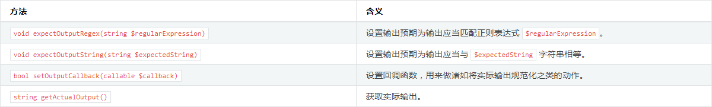
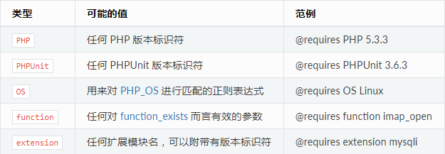

phpunit学习笔记
===
目录
---

[安装phpunit](#安装phpunit)  
[编写 PHPUnit 测试](#编写_PHPUnit_测试)  
[命令行测试执行器](#命令行测试执行器)  
[基境(fixture)](#基境fixture)  
[组织测试](#组织测试)  
[有风险的测试](#有风险的测试)  
[未完成的测试与跳过的测试](#未完成的测试与跳过的测试)  
[数据库测试](#数据库测试)  
[测试替身](#测试替身)  
[测试实践](#测试实践)  
[代码覆盖率分析](#代码覆盖率分析)  
[测试的其他用途](#测试的其他用途)  
[参考](#参考)  

安装phpunit
---
* PHP 档案包 (PHAR)
    
    >详细见 : [安装 PHPUnit](https://phpunit.readthedocs.io/zh_CN/latest/installation.html)
* Composer

    >如果用 Composer 来管理项目的依赖关系，只要在项目的 composer.json 文件中简单地加上对 phpunit/phpunit 的依赖关系即可：
    `composer require --dev phpunit/phpunit ^6.5`

编写 PHPUnit 测试
---
* 用PHPUnit编写测试的基本惯例与步骤 [@](NumTest.php)

    1. 测试类都写在 `ClassTest` 中，比如 `UserTest`。
    2. 测试类都继承自 `PHPUnit\Framework\TestCase`。
    3. 具体测试都写在 `test*` 的方法中。
    4. 在测试方法中使用断言方法来判断实际结果与预期值是否匹配。
    
* 测试的依赖关系 [@](DependsTest.php)

    * 每个测试方法并不一定必须是一个独立的测试单元，也可以作为其它测试的依赖。
    * **生产者在代码中必须位于依赖于它的消费者上方**  。
    * 允许多重依赖。

    * 生产者(producer)，是能生成被测单元并将其作为返回值的测试方法。
    * 消费者(consumer)，是依赖于一个或多个生产者及其返回值的测试方法。
    
    >默认情况下，生产者所产生的返回值将“原样”传递给相应的消费者。这意味着，如果生产者返回的是一个对象，那么传递给消费者的将是一个指向此对象的引用。如果需要传递对象的副本而非引用，则应当用 `@depends clone` 替代 `@depends`。

* 数据供给器 [@](ProviderTest.php)

    * 测试方法可以接受任意参数。用 `@dataProvider` 标注来指定使用哪个数据供给器方法。
    * 数据供给器方法必须声明为 public，其返回值要么是一个数组，其每个元素也是数组；要么是一个实现了 `Iterator` 接口的对象，在对它进行迭代时每步产生一个数组。每个数组都是测试数据集的一部分，将以它的内容作为参数来调用测试方法。
    * 数据供给器返回的数组可以使用字符串作为键名，在某一组数据测试出错时有友好提示
    * 如果测试同时从 `@dataProvider` 方法和一个或多个 `@depends` 测试接收数据，数据供给器的参数先于依赖传入，依赖对应位置的参数每次都是一样的。
    * 使用了数据供给器的测试，该测试的返回数据不能传入依赖于该数据的测试。

* 对异常进行测试 [@](ExceptionTest.php)

    * 在测试中调用 `expectException()` 、`expectExceptionCode()`、`expectExceptionMessage()` 或 `expectExceptionMessageRegExp()`方法为被测代码所抛出的异常建立预期，如果之后抛出指定异常，则测试成功。
    * 使用标注可以完成同样的测试 : `@expectedException` 、 `@expectedExceptionCode` 、 `@expectedExceptionMessage` 和 `@expectedExceptionMessageRegExp`。

* 对错误进行测试 [@](ExceptionTest.php)
    * 默认情况下，PHPUnit 将测试在执行中触发的 PHP 错误、警告、通知都转换为异常。利用这些异常，预期测试将触发 PHP 错误。
    * PHP 的 error_reporting 运行时配置会对 PHPUnit 将哪些错误转换为异常有所限制。

* 对输出进行测试 [@](ExceptionTest.php)
    * PHPUnit使用 PHP 的 **`输出缓冲`** 特性来为此提供必要的功能支持。
    
    
    
* 错误相关信息的输出
    >当有测试失败时，PHPUnit 全力提供尽可能多的有助于找出问题所在的上下文信息。

* 边缘情况
    >当比较失败时（测试已经failure），PHPUnit 为输入值建立文本表示，然后以此进行对比，输出错误对比信息，所以可能输出的信息中，错误的地方比实际不匹配的地方多。

命令行测试执行器
---
可以通过执行 `phpunit` 命令来运行测试。例如：`phpunit ClassTest` ，PHPUnit 命令行测试执行器将在当前工作目录中寻找 ClassTest.php 源文件并加载之。而在此源文件中应当能找到 ArrayTest 测试用例类，此类中的测试将被执行（大多数测试类是这样编写的，但文件名和类名可以不相同）。

* 对于每个测试的运行，PHPUnit 命令行工具输出一个字符来指示进展：

    * ` . ` 当测试成功时输出。  
    * ` F ` 当测试方法运行过程中一个断言失败时输出。  
    * ` E ` 当测试方法运行过程中产生一个错误时输出。  
    * ` R ` 当测试被标记为有风险时输出（参见:ref:risky-tests）。  
    * ` S ` 当测试被跳过时输出（参见:ref:incomplete-and-skipped-tests）。  
    * ` I ` 当测试被标记为不完整或未实现时输出（参见:ref:incomplete-and-skipped-tests）。

* 选项:

    * ` --colors ` 使用彩色输出。  
    * ` --repeat ` 将测试重复运行指定次数。  
    * ` -d ` 置指定的 PHP 配置选项的值。  
    * 更多选项查看官方文档: [PHPUnit Manual](https://phpunit.readthedocs.io/zh_CN/latest/)

基境(fixture)
---
* 基本使用 [@](StackTest.php)

    在编写测试时，最费时的部分之一是编写代码来将整个场景设置成某个已知的状态，并在测试结束后将其复原到初始状态。这个已知的状态称为测试的 基境(fixture)。

    * `setup()` 每个测试方法在运行之前运行一次，可以在此方法中初始化测试需要的环境。  
    * `tearDown()` 每个测试方法在测试结束后运行一次，可以用来销毁 `setUp()` 中加载的资源。  

* 共享基境 [@](StackTest.php)

    在测试之间共享基境会降低测试的价值。潜在的设计问题是对象之间并非松散耦合。如果解决掉潜在的设计问题并使用桩件(stub)（参见:ref:test-doubles）来编写测试，就能达成更好的结果，而不是在测试之间产生运行时依赖并错过改进设计的机会
    * `setUpBeforeClass()` 在第一个测试方法运行之前运行一次。  
    * `tearDownAfterClass()` 在最后一个测试方法运行结束运行一次。  
    * `assertPreConditions()` `assertPostConditions()` `onNotSuccessfulTest()` 等。
    
* 全局状态
    
    通常情况下，欲测代码和全局变量之间会强烈耦合，并且其创建无法控制。另外一个问题是，一个测试对全局变量的改变可能会破坏另外一个测试。

    * 在版本 6 中，默认情况下 PHPUnit 不再对全局变量和超全局变量进行备份与恢复的操作。可以用 `--globals-backup` 选项或在 XML 配置文件中用 `backupGlobals="true"` 将其激活。版本6之前是默认开启的。  
    * 使用标注 ` @backupGlobals ` 也可以控制备份与恢复。
    * 可以提供一个全局变量的黑名单，黑名单中的全局变量将被排除于备份与还原操作之外。
    
            class MyTest extends TestCase
            {
                protected $backupGlobalsBlacklist = ['globalVariable'];
            
                // ...
            }
            // 在方法（例如 setUp() 方法）内对 $backupGlobalsBlacklist 属性进行设置是无效的。
    * 通过用 `--static-backup` 选项或在 XML 配置文件中设置`backupStaticAttributes="true"`，可以将此隔离扩展到类的静态属性。
    >对全局变量和类的静态属性的备份与还原操作使用了 serialize() 与 unserialize()，某些类的实例对象（比如 PDO）无法序列化，因此如果把这样一个对象存放在比如说 $GLOBALS 数组内时，备份操作就会出问题。
    
    * 使用标注 `@backupStaticAttributes` 可以在每个测试方法前后备份和恢复所有已声明类的**静态属性**。
    * 可以提供黑名单来将静态属性从备份与还原操作中排除出去
    
            class MyTest extends TestCase
            {
                protected $backupStaticAttributesBlacklist = [
                    'className' => ['attributeName']
                ];
            
                // ...
            }
            // 在方法（例如 setUp() ）内对 $backupStaticAttributesBlacklist 属性进行设置是无效的。

组织测试
---
PHPUnit 的目标之一是测试应当可组合：我们希望能将任意数量的测试以任意组合方式运行，例如，整个项目的所有测试，或者项目中的某个组件内的所有类的测试，又或者仅仅某单个类的测试。

* 用文件系统来编排测试套件

    简单来说就是将所有测试用例的文件放在同一个目录下，使用命令行测试器，对目录遍历测试。
    >这种方法的缺点是无法控制测试的运行顺序。这可能导致测试的依赖关系方面的问题。

* 用 XML 配置来编排测试套件
        
        // 指定测试目录
        <phpunit bootstrap="src/autoload.php">
            <testsuites>
                <testsuite name="money">
                <directory>tests</directory>
                </testsuite>
            </testsuites>
        </phpunit>

        // 指定测试顺序
        <phpunit bootstrap="src/autoload.php">
            <testsuites>
                <testsuite name="money">
                <file>tests/IntlFormatterTest.php</file>
                <file>tests/MoneyTest.php</file>
                <file>tests/CurrencyTest.php</file>
                </testsuite>
            </testsuites>
        </phpunit>

有风险的测试
---
* 无用测试

    PHPUnit 可以更严格对待事实上不测试任何内容的测试。可以用命令行选项 `--report-useless-tests` 或在 PHPUnit 的 XML 配置文件中设置 `beStrictAboutTestsThatDoNotTestAnything="true"` 来启用。

    在启用本项检查后，如果某个测试未进行任何断言，它将被标记为有风险。

* 意外的代码覆盖

    PHPUnit 可以更严格对待意外的代码覆盖。此项检查可以用命令行选项 `--strict-coverage` 或在 PHPUnit 的 XML 配置文件中设置 `beStrictAboutCoversAnnotation="true"` 来启用。

    在启用本项检查后，如果某个带有 `@covers` 标注的测试执行了未在 `@covers` 或 `@uses` 标注中列出的代码，它将被标记为有风险。

* 测试执行期间产生的输出

    PHPUnit 可以更严格对待测试执行期间产生的输出。 此项检查可以用命令行选项 `--disallow-test-output` 或在 PHPUnit 的 XML 配置文件中设置 `beStrictAboutOutputDuringTests="true"` 来启用。

    在启用本项检查后，如果某个测试产生了输出，它将被标记为有风险。

* 测试执行时长的超时限制

    此功能需要安装 `PHPUnit\PHP_Invoker` 包，并且 `pcntl` 扩展可用。用命令行选项 `--enforce-time-limit` 或在 PHPUnit 的 XML 配置文件中设置 `beStrictAboutTestSize="true"` 来启用。

    可以通过XML配置文件中的 `timeoutForLargeTests` 属性进行配置超时时间。

    带有 @large 标注的测试如果执行时间超过60秒将视为失败，带有 @medium 标注的测试如果执行时间超过10秒将视为失败，带有 `@small` 标注的测试如果执行时间超过1秒将视为失败。

* 全局状态篡改

    PHPUnit 可以更严格对待篡改全局状态的测试。此项检查可以用命令行选项 `--strict-global-state` 或在 PHPUnit 的 XML 配置文件中设置 `beStrictAboutChangesToGlobalState="true"` 来启用。

未完成的测试与跳过的测试
---
* 未完成的测试 [@](SimpleTest.php)

    在测试方法内部调用 `markTestIncomplete()` 方法，将当前测试标记为未完成。

* 跳过测试 [@](SimpleTest.php)

    在测试方法内部调用 `markTestSkipped()`方法，跳过当前测试，使得测试结果的Skipped多了一个。也可以提前在 `setUp()` 方法中调用，接下来的测试方法会被跳过。
    
* 用 `@requires` 来跳过测试 [@](RequireTest.php)

    可以用 `@requires` 标注来表达测试用例的一些常见前提条件。如果不满足条件则跳过当前测试。
    
    
    
数据库测试
---
* 配置（不仅可以在数据库测试中使用，也可以在测试某一测试套件时为其指定不同配置文件进行测试）
    
    * 编写配置文件
    
            <?xml version="1.0" encoding="UTF-8" ?>
            <phpunit>
                <php>
                    <var name="DB_DSN" value="mysql:dbname=myguestbook;host=localhost" />
                    <var name="DB_USER" value="user" />
                    <var name="DB_PASSWD" value="passwd" />
                    <var name="DB_DBNAME" value="myguestbook" />
                </php>
            </phpunit>
    * 测试时指定配置
            
            // 可以在测试方法中使用$GLOBALS['FILED']来取得配置数据
            
            phpunit --configuration developer-a.xml MyTests/
        
* 数据库测试基本使用 [@](DbTest.php)
    
    需要扩展另一个抽象 TestCase 类，它要求实现两个抽象方法，`getConnection()` 和 `getDataSet()`
    
    * 实现 `getConnection()`
        
        * 需要建立数据库连接，返回`PHPUnit_Extensions_Database_DB_IDatabaseConnection`的对象。
        * 数据库测试需要使用PDO模块与实际测试的功能没有任何关系，这里的PDO仅仅用于清理和建立基境。
            
    * 实现 `getDataSet()`
    
        * `getDataSet()` 方法定义了在每个测试执行之前的数据库初始状态应该是什么样

* 数据集
    
    * Flat XML DataSet （平直 XML 数据集）
            
        * 用法
        
                <?xml version="1.0" ?>
                <dataset>
                    // <表名 键="值" 键="值" 键="值" />
                    <guestbook id="1" content="Hello buddy!" user="joe" created="2010-04-24 17:15:23" />
                    <guestbook id="2" content="I like it!" user="nancy" created="2010-04-26 12:14:20" />
                </dataset>
                
        * 空表
        
                <?xml version="1.0" ?>
                <dataset>
                    <guestbook />
                </dataset>
                
        * NULL值
        
                <?xml version="1.0" ?>
                <dataset>
                    <guestbook id="1" content="Hello buddy!" user="joe" created="2010-04-24 17:15:23" />
                    <guestbook id="2" content="I like it!" created="2010-04-26 12:14:20" />
                </dataset>
                
            >通过省略某个属性来表示属性值为NULL，但第一行的属性不能省略，第一行的属性会被认为是表拥有的字段  
            >建议: 属性值存在NULL的表不使用 Flat XML DataSet

    * XML DataSet （XML 数据集）
        
            <?xml version="1.0" ?>
            <dataset>
                <table name="guestbook">
                    <column>id</column>
                    <column>content</column>
                    <column>user</column>
                    <column>created</column>
                    <row>
                        <value>1</value>
                        <value>Hello buddy!</value>
                        <value>joe</value>
                        <value>2010-04-24 17:15:23</value>
                    </row>
                    <row>
                        <value>2</value>
                        <value>I like it!</value>
                        <null />
                        <value>2010-04-26 12:14:20</value>
                    </row>
                </table>
            </dataset>
            
        * 没有row元素表示空表
        * value对应column的顺序
        * <null /> 表示字段值为NU

    * MySQL XML DataSet （MySQL XML 数据集）
        
        通过 mysqldump 命令导出的xml数据，也可以作为数据集使用
    
    * YAML DataSet （YAML 数据集）
            
            guestbook:
              -
                id: 1
                content: "Hello buddy!"
                user: "joe"
                created: 2010-04-24 17:15:23
              -
                id: 2
                content: "I like it!"
                user:
                created: 2010-04-26 12:14:20
        
        数据库 TestCase 中没有 YAML DataSet 的工厂方法，因此需要手工进行实例化 :
        
            <?php
            use PHPUnit\Framework\TestCase;
            use PHPUnit\DbUnit\TestCaseTrait;
            use PHPUnit\DbUnit\DataSet\YamlDataSet;
            
            class YamlGuestbookTest extends TestCase
            {
                use TestCaseTrait;
            
                protected function getDataSet()
                {
                    return new YamlDataSet(dirname(__FILE__)."/_files/guestbook.yml");
                }
            }
    * CSV DataSet （CSV 数据集）
        
            id,content,user,created
            1,"Hello buddy!","joe","2010-04-24 17:15:23"
            2,"I like it!","nancy","2010-04-26 12:14:20"
        
        无法制指定NULL值，可以这样创建 CSV DataSet：
        
            <?php
            use PHPUnit\Framework\TestCase;
            use PHPUnit\DbUnit\TestCaseTrait;
            use PHPUnit\DbUnit\DataSet\CsvDataSet;
            
            class CsvGuestbookTest extends TestCase
            {
                use TestCaseTrait;
            
                protected function getDataSet()
                {
                    $dataSet = new CsvDataSet();
                    $dataSet->addTable('guestbook', dirname(__FILE__)."/_files/guestbook.csv");
                    return $dataSet;
                }
            }
        
    * Array DataSe （数组数据集） [@](ArrayDataSet.php)
    * Query (SQL) DataSet （查询(SQL)数据集）
    
            <?php
            $ds = new PHPUnit_Extensions_Database_DataSet_QueryDataSet($this->getConnection());
            $ds->addTable('guestbook');
            ?>
            
            <?php
            $ds = new PHPUnit_Extensions_Database_DataSet_QueryDataSet($this->getConnection());
            $ds->addTable('guestbook', 'SELECT * FROM guestbook');
            ?>
            
            <?php
            $ds = new PHPUnit_Extensions_Database_DataSet_QueryDataSet($this->getConnection());
            $ds->addTable('guestbook', 'SELECT id, content FROM guestbook ORDER BY created DESC');
            ?>
        
    * Database (DB) Dataset （数据库数据集）[@](DatabaseDataSet.php)
    * Replacement DataSet （替换数据集）
        
            通过替换可以解决Flat XML、CSV DataSet 的 NULL 问题。
        
    * DataSet Filter （数据集筛选器）
    * Composite DataSet （组合数据集）

* 数据库连接 API
    
    * `createDataSet()` 方法创建 Database (DB) DataSet(数据库数据集) [@](DbTest.php)
    
    * `createQueryTable()` 方法用于创建 QueryTable 的实例 [@](DbTest.php)

    * `getRowCount()` 方法提供了一种方便的方式来取得表中的行数 [@](DbTest.php)
        
            
* 数据库断言 API

    * 对表中数据行的数量作出断言 [@](DbTest.php)
    * 对表的状态作出断言 [@](DbTest.php)
    * 对多个表的状态作出断言 [@](DbTest.php)

测试替身
---
有时测试环境下不能使用被测功能的组件，可以使用测试替身来代替，其只需要提供和真正组件相同的API即可。

* Stubs （桩件）
    
    * 上桩 [@](StubTest.php)
        
        配置测试替身方法的返回值。步骤如下:
        
        1. 为需要的类生成桩件
        2. 流畅式接口配置桩件
        3. 调用桩件和断言

        >如果原始类中包含"method"方法，就必须使用：  
        >`$stub->expects($this->any())->method('doSomething')->willReturn('foo');`
    
    * 流畅式接口（对替身的伪方法进行配置） [@](StubTest.php)
    
        * 配置方法的实参作为返回值返回
        
        `$stub->method('doSomething')->will($this->returnArgument(0));`
    
        * 配置方法返回桩件对象的引用
        
        `$stub->method('doSomething')->will($this->returnSelf());`
    
        * 配置方法在不同参数下返回相应值
        
        `$stub->method('doSomething')->will($this->returnValueMap($map));`
        
        * 配置返回调用指定函数
        
        `$stub->method('doSomething')->will($this->returnCallback('str_rot13'));`

        * 配制方法返回期望值(会按给定顺序返回)
        
        `$stub->method('doSomething')->will($this->onConsecutiveCalls(2, 3, 5, 7));`
        
        * 配置方法抛出异常
        
         `$stub->method('doSomething')->will($this->throwException(new Exception));`

* 仿件对象(Mock Object)

    * 模仿 [@](MockTest.php)
        
        配置测试替身，使其能够验证预期行为。
        
        比如，给仿件对象上的方法配置，预期该方法会被调用几次，调用时的参数是什么，来完成整个模仿。
        
    * 模仿相关方法 [@](MockTest.php)
    
        * `expects()` 指定方法调用的次数
        
                // 只调用一次
                `$mock->expects($this->once())...`
                // 调用两次
                `$mock->expects($this->exactly(2))...`
        
        * `with()` 指定方法被调用的实参规则
        
                // 预期被调用的实参为'something'
                `...->with($this->equalTo('something'));`
                // 对参数多种形式的约束，第一个参数大于0，第二个参数包含'Something'，第三个参数任意
                `->with(
                           $this->greaterThan(0),
                           $this->stringContains('Something'),
                           $this->anything()
                );`

        * `withConsecutive()` 指定方法被调用的实参的多组规则 [@](MockTest.php)
        
        * `callback()` 指定更复杂的实参检验规则，指定一个回调函数作为验证规则
        
        * `identicalTo()` 指定实参为某一对象
        
    * 仿件生成器提供的方法:
    
        * `setMethods(array $methods)` 可以在仿件生成器对象上调用，来指定哪些方法将被替换为可配置的测试替身。其他方法的行为不会有所改变。如果调用 `setMethods(null)`，那么没有方法会被替换。
        * `setConstructorArgs(array $args)` 可用于向原版类的构造函数（默认情况下不会被替换为伪实现）提供参数数组。
        * `setMockClassName($name)` 可用于指定生成的测试替身类的类名。
        * `disableOriginalConstructor()` 参数可用于禁用对原版类的构造方法的调用。
        * `disableOriginalClone()` 可用于禁用对原版类的克隆方法的调用。
        * `disableAutoload()` 可用于在测试替身类的生成期间禁用 `__autoload()`。
    
* Prophecy [@](https://github.com/phpspec/prophecy)
    
* 对特质(Trait)与抽象类进行模仿 [@](TraitTest.php)

* 对 Web 服务(Web Services)进行上桩或模仿

* 对文件系统进行模仿

测试实践
---

代码覆盖率分析
---

测试的其他用途
---

Logging
---
    
参考
---
[PHPUnit Manual](https://phpunit.readthedocs.io/zh_CN/latest/)